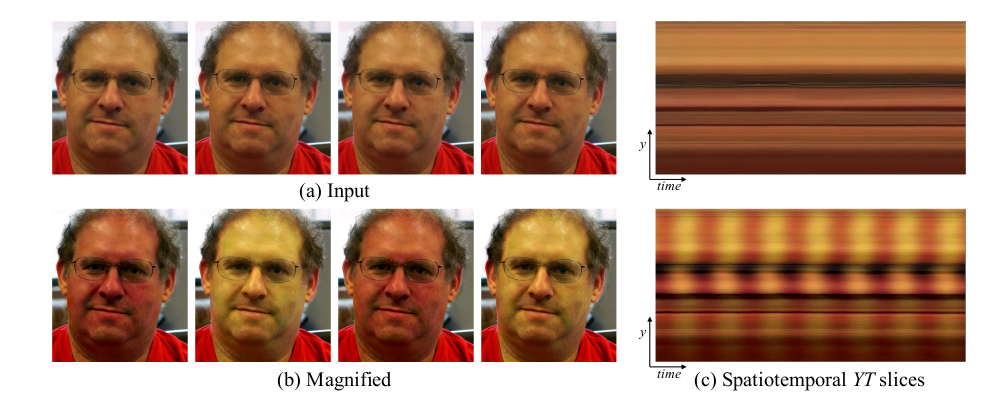

# Heartrate-Detection-

This is a Contactless heart rate detection using Eulerian magnification. This innovation allows for liveliness detection for KYC and mass monitoring of people's heart rates without contact in hospitals. 

# To Run
Install neccessary dependencies
'''
pip install -r requirements.txt 
'''

Lunch app
'''
streamlit run app.py 
'''